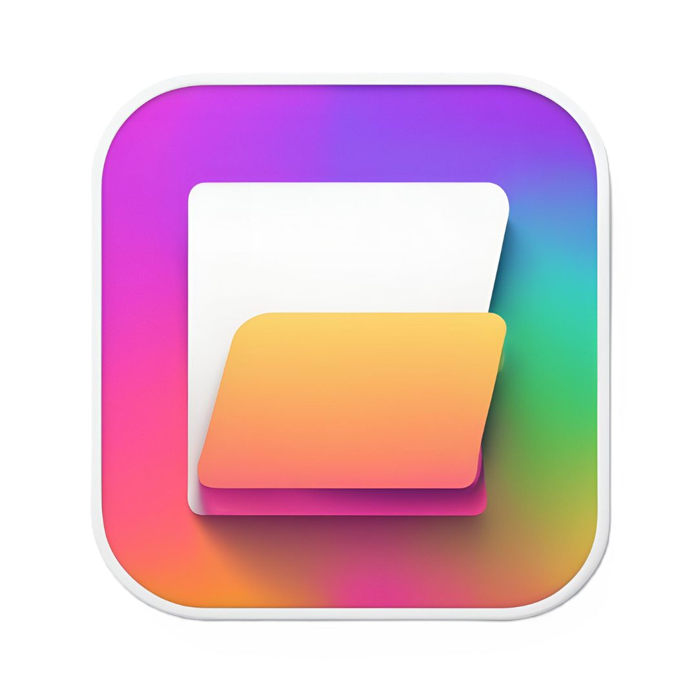
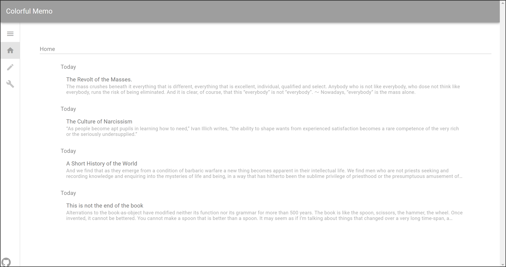
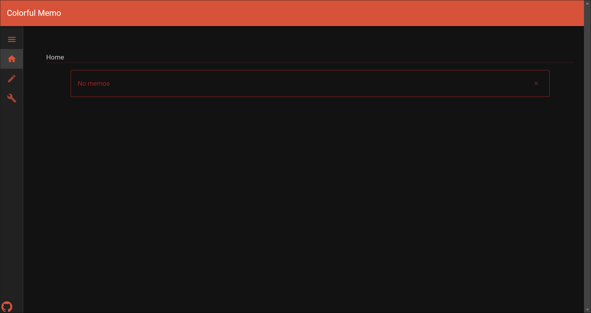

# Colorful Memo

<p align="center">
    
</p>

## Description

Colorful Memo is a simple single page application for taking memo.
This application allows users to select theme mode, color and button design.

---

## UI

### Home with Memo



---

### Home without Memo



---

### Adding Memo


---

### Editing Memo


---

### Setting


## Theme

- Light
- Dark

## Color

- Default (Gray)
- Blue
- Red
- Yellow
- Green

## Developed with

- [Vue3](https://github.com/vuejs)
- [Vuetify](https://github.com/vuetifyjs/vuetify)
- [Pinia](https://github.com/vuejs/pinia)
- [TypeScript](https://github.com/microsoft/TypeScript)

## Project setup

```
npm install
```

## Project build

```
npm run build
```

## Project build and hot-reloads for dev

```
npm run dev
```
