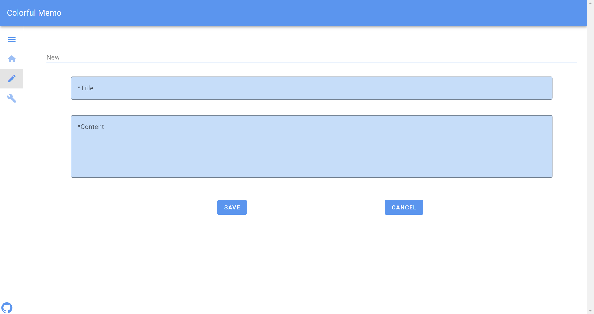

# Colorful Memo


---



---


---


## Description

The Colorful Memo is a simple single page application, using local storage for storing memos.  
This application allows users to select theme mode, color and component design.

## Theme

- Light
- Dark

## Color

- Blue
- Red
- Yellow
- Green

## Developed with

- [Vue3](https://github.com/vuejs)
- [Vuetify](https://github.com/vuetifyjs/vuetify)
- [Pinia](https://github.com/vuejs/pinia)
- [TypeScript](https://github.com/microsoft/TypeScript)

## Project setup

```
npm install
```

## Project build

```
npm run build
```

## Project build and hot-reloads for dev

```
npm run dev
```
